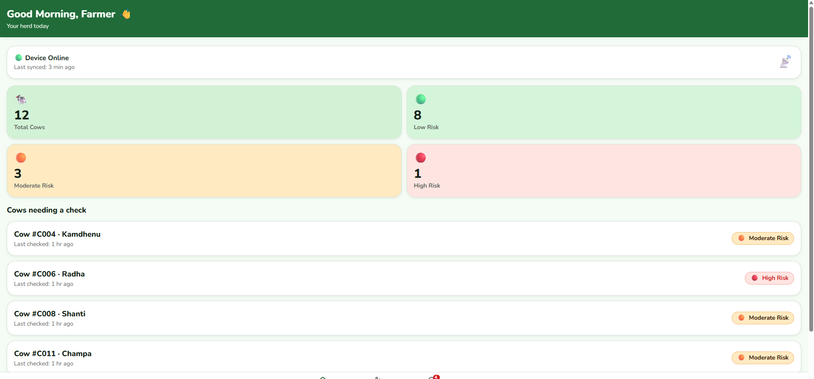
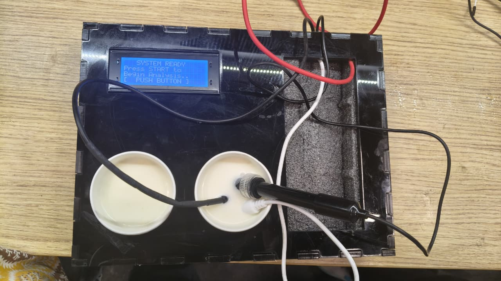

<p align="center">
  
</p>

<h1 align="center">CattleΨic</h1>

<p align="center">
  <b>AI-Assisted Edge System for Early Mastitis Risk Forecasting in Dairy Cattle</b>
</p>

<p align="center">
  <b>Team Nodeverse</b> • SIH26109 • Raspberry Pi • Multi-Sensor Milk Analysis • Farmer Dashboard
</p>

---

## 🚀 Project Overview

CattleΨic is a Raspberry Pi based cattle-health platform designed for early mastitis-risk assessment using milk-quality sensing, edge intelligence, offline operation and farmer-facing outputs.

The current prototype combines **pH, electrical conductivity (EC), temperature and turbidity** measurements with local processing, a trained Random Forest model, offline records, a larger integrated local display, dashboard connectivity and compact thermal receipt output.

> **Current stage:** integrated working prototype / approximately 60% overall development.

> **Important:** the Random Forest model has been trained on the available labelled dataset. Final on-device deployment validation, sensor calibration and large-scale field validation are continuing. No unsupported clinical-accuracy or 7–14 day performance claim is made here without corresponding evaluation evidence.

---

## 📸 Prototype Preview

<p align="center">
  
  
</p>

> The hardware photo above is retained as evidence of earlier prototype progress. The current hardware revision replaces the small character LCD with a larger Raspberry Pi-compatible display/touchscreen.

---

## ✨ Key Features

- Raspberry Pi edge processing
- pH, EC, temperature and turbidity sensing pipeline
- ADS1115 analog sensor interface
- Multiple-reading averaging and preprocessing
- **Trained Random Forest model** for mastitis-risk classification
- Large integrated local display / touchscreen direction
- Low / Moderate / High risk output design
- Offline local storage when internet is unavailable
- Cloud/backend synchronization architecture
- Farmer dashboard and cow-wise history architecture
- **58 mm thermal receipt output** for physical farmer test slips
- Mobile/app alert architecture
- Scalable animal → herd → cooperative data model

## ⚙️ End-to-End Flow

```text
Milk Sample
     ↓
pH + EC + Temperature + Turbidity Sensors
     ↓
ADS1115 + Raspberry Pi
     ↓
Filtering + Averaging + Feature Preparation
     ↓
Trained Random Forest Risk Model
     ↓
Low / Moderate / High Risk
     ↓
┌────────────────────┬────────────────────┬─────────────────────┐
│ Large Local Display│ Dashboard / Cloud  │ 58 mm Receipt Slip  │
│                    │ + Offline Records  │                     │
└────────────────────┴────────────────────┴─────────────────────┘
```

## 🔧 Hardware Architecture

| Component | Function | Status |
|---|---|---|
| Raspberry Pi | Main edge-processing controller | Current design |
| ADS1115 | Analog sensor interface | Prototype |
| pH Sensor | Milk pH measurement | Calibration / refinement ongoing |
| EC Sensor | Electrical conductivity measurement | Calibration / refinement ongoing |
| DS18B20 | Temperature measurement | Prototype |
| Turbidity Sensor | Additional optical/turbidity input | Prototype / evidence validation ongoing |
| Large Display / Touchscreen | Local readings, test progress, risk and actions | Current hardware revision |
| Push Button | Starts / controls a milk test | Prototype |
| 58 mm Thermal Printer | Prints physical farmer test report | Current integration extension |

## 🖥️ Large Local Display

The small 16x4 LCD concept has been removed from the current design. CattleΨic now uses a larger Raspberry Pi-compatible display/touchscreen direction so the farmer can clearly see:

- Cow ID
- live sensor values
- test progress
- risk result
- short next-step guidance
- printer/report status

➡️ [View integrated display design](hardware/display/README.md)

## 🧾 Farmer Receipt Output

A compact **58 mm thermal receipt printer** is included in the current device architecture so the same result shown digitally can also be printed immediately as a physical slip.

The receipt can contain:

- Cow ID
- Test ID and date/time
- pH
- EC
- temperature
- turbidity
- risk status
- short farmer/veterinary guidance

➡️ [View thermal receipt printer integration](docs/thermal-receipt-printer.md)

## 🧠 AI / ML Status

### ✅ Completed

- Random Forest model training on the available labelled dataset
- Feature-based mastitis-risk classification workflow
- Model architecture selected for edge deployment

### 🟡 Current Integration / Validation Work

- Connect the trained model artifact to the final Raspberry Pi inference pipeline
- Document exact train/validation/test split and evaluation metrics
- Validate performance across more cows, farms and milk conditions
- Calibrate probability/risk thresholds for farmer-facing Low / Moderate / High output

➡️ [View ML module](ml/README.md)  
➡️ [View Random Forest model card](ml/model-card.md)

## 📈 Prototype Status

### ✅ Implemented / Demonstrated

- Raspberry Pi sensor acquisition pipeline
- pH, EC, temperature and turbidity input handling
- Multiple-reading averaging / preprocessing
- Random Forest model training
- Offline data handling
- Backend communication architecture
- Farmer dashboard prototype
- Cow-wise test-history architecture
- Large-display software interface
- Thermal receipt format + formatter scaffold

### 🟡 Current Build / Integration Work

- Sensor calibration with reference samples
- Final Raspberry Pi model deployment integration
- Live device-to-cloud synchronization
- Physical thermal-printer connection
- Final large-display mounting / enclosure
- Alert service integration
- Model evaluation documentation

➡️ [View current device inventory & status](docs/current-device-inventory.md)

## 🎯 SIH26109 Alignment

CattleΨic is designed around the core SIH26109 direction: sensor hardware, edge AI, animal-wise records, cloud/dashboard connectivity, alerts, offline resilience and scalable herd intelligence.

➡️ [View detailed SIH26109 requirement mapping](docs/sih26109-requirements.md)

## 📊 Comparison & Gap Analysis

The comparison document tracks what CattleΨic already includes, what public mastitis projects demonstrate and which advanced modules remain for later expansion.

➡️ [View comparison and gap analysis](docs/comparison-gap-analysis.md)

## 🔗 PPT / Demo Evidence Links

- [GitHub Repository](https://github.com/Team-Nodeverse/Bovine-mastitis-prediction)
- [Current Device Inventory](docs/current-device-inventory.md)
- [Working Hardware Evidence](assets/hardware-prototype.jpeg)
- [Dashboard Preview](dashboard-home.png)
- [Large Display Design](hardware/display/README.md)
- [Thermal Receipt Design](docs/thermal-receipt-printer.md)
- [System Architecture](docs/architecture.md)
- [ML Module](ml/README.md)
- [Random Forest Model Card](ml/model-card.md)
- [PPT Clickable Link Map](docs/ppt-link-map.md)

## 🔬 Research & Evidence

External research is used to guide feature selection, validation strategy and future system expansion. External results are not presented as CattleΨic performance metrics.

➡️ [Research & references](docs/references.md)

## 🔮 Future Scope

Future scope is reserved for larger capabilities beyond the present prototype build:

- wearable smart-collar module for activity, rumination and body-temperature signals
- SCC / laboratory record integration at scale
- cooperative-level herd analytics across many farms
- GIS mastitis hotspot and risk-cluster mapping
- multimodal longitudinal forecasting using milk + animal + environment + treatment history
- solar / field-hardened enclosure for long-duration deployment
- large-scale multi-farm veterinary validation
- integration with dairy cooperative / government livestock-health systems

## 👥 Team

**Team Nodeverse**

Building practical, farmer-friendly technology for livestock health and precision dairy management.
